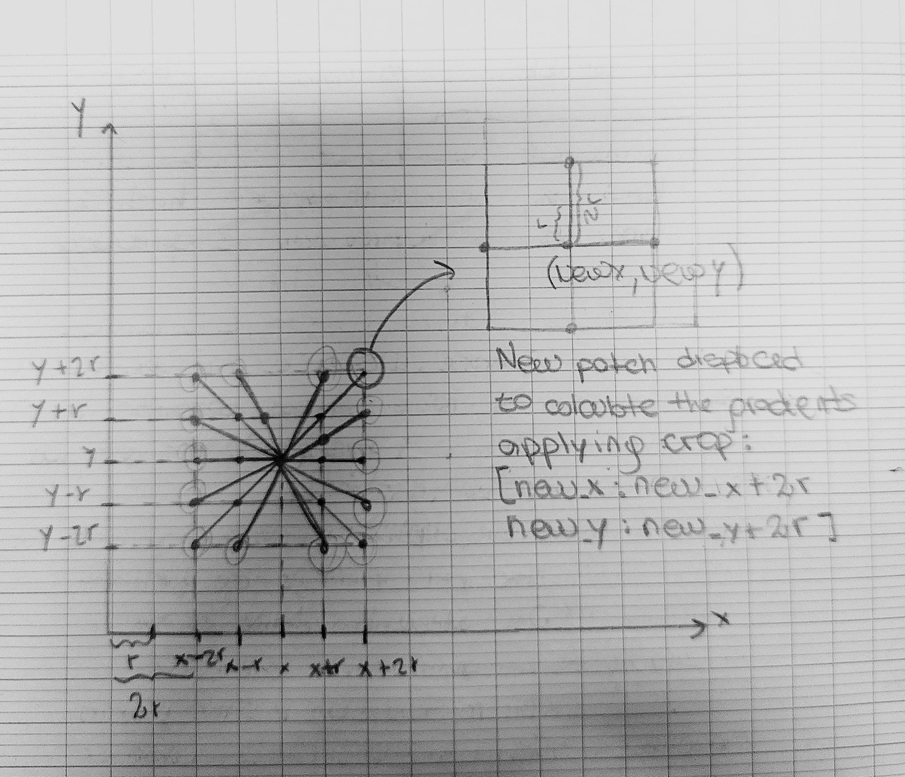

  

# Blemish Removal Application

## Problema statement
Blemishes or dark spots are parts of the skin region which have high roughness relative to the neighboring region. We can detect these regions by finding the region with high gradients. For doing so, we convolve the given image with the Sobel Filter or Laplacian filter kernels.

This Application uses both analysis to make the best performance out of it:

### By using Spatial Domain Analysis (Sobel filters)
In this section we will compare, for an image patch, how the gradient images look like and what information can we get from them. We apply sobel filter to two patches - one at a smooth region and the other one to the blemish on the cheek. As follows a representation of the spatial domain to be analyzed

  

As you can see we take a predefined patch size, and then move around the extremes of it creating a new patch of the same size. This is important in order to preserve a smooth transition between the blemish region and the sorrounding area (non-blemish region). 

After this we apply the sobel filters in both X and Y directions in order to get the first order derivatives, and append this to a dictionary, with that patch information listed with a key number. This process is performed over 16 points around the region previously selected.

Finally we take the lowest gradient value in X and Y of each of the key patches, compare them and replace the selected region with that key patch (this way we guarantee the smooth transition between regions)

### And Frequency domain Analysis (Laplacian filter Kernels)
If the method described above doesn't find the lowest gradient between the two key patches, we proceed to do a second order analysis. 

To reach this challenging step, we will use Fourier Transform for analysing the frequency content of the image. For a 1-D signal, if the value of the signal varies very fast, it is said to be a high frequency signal. Similarly for a 2-D signal like image, if the intensity values vary a lot, it is said to have high frequency content. For regions having gradients / edges or random noise, the frequency content increases. For a smooth region, the intensity variation is very less, thus a smooth region will have very low frequency content

  

Here if both key patches are the same an image with the MAgnitud spectrum is going to be generated by the App, and the user can pick which key patch the want to apply to the blemished region. This is a culitative analysis  based on the frequencies present in the key patch. 

In simple words, the more colorful or shifted to the red colours we have in the image the more nosy will be. Therefore, the smoothless the transition will be

This last approach is a finetuned aproximation to imporve the quality of the blemish removal

## Results

  
  

# References and further readings

1. [http://docs.opencv.org/2.4/doc/tutorials/core/discrete_fourier_transform/discrete_fourier_transform.html]

2. [http://docs.opencv.org/3.0-beta/doc/py_tutorials/py_imgproc/py_transforms/py_fourier_transform/py_fourier_transform.html]

3. [http://docs.opencv.org/3.2.0/d5/d0f/tutorial_py_gradients.html]

4. [http://docs.opencv.org/3.1.0/d2/d2c/tutorial_sobel_derivatives.html]

5. [http://docs.opencv.org/3.0-beta/modules/photo/doc/cloning.html]